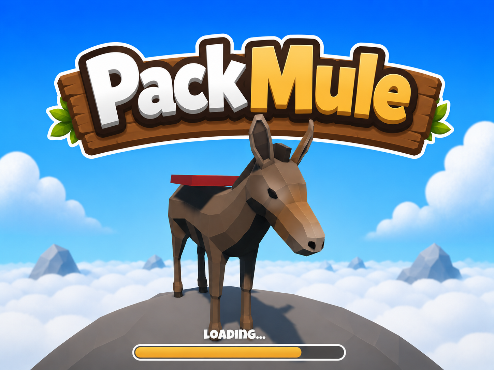
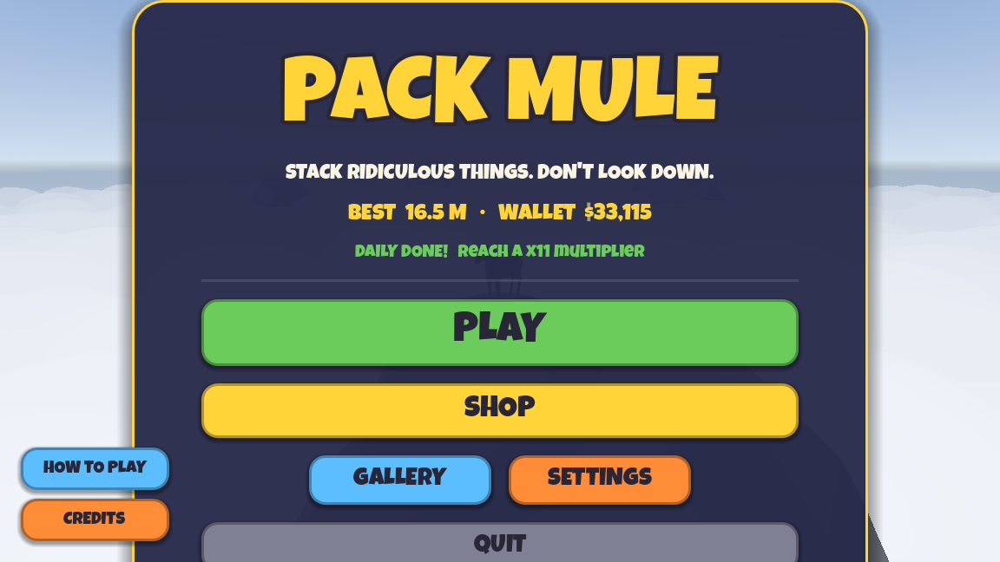
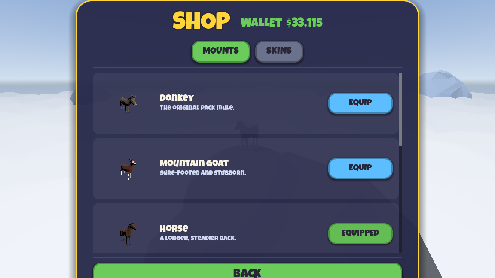
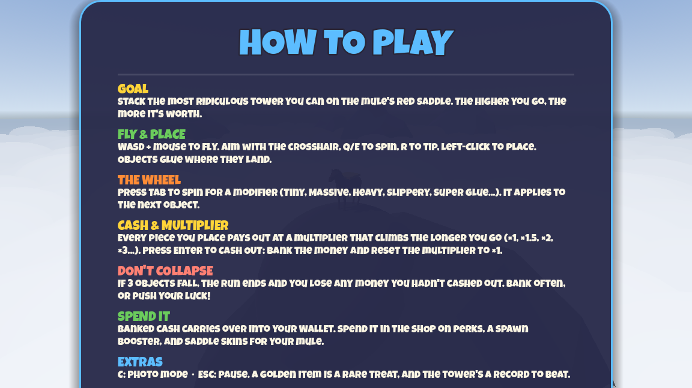

# Pack Mule

### Stack ridiculous things on a mule. Don't look down.

**[▶ Play in the browser](https://packmule.netlify.app)** · made with Godot 4.5

---

**Pack Mule** is a 3D physics stacking game. Fly around a mountain peak and pile
absurd cargo — fridges, pianos, a whole T‑Rex — onto your pack animal's saddle.
The longer you stack without cashing out, the higher your multiplier climbs;
one collapse and everything you hadn't banked is gone. Push your luck.

## Screenshots

| Main menu | Shop | How to play |
| :---: | :---: | :---: |
|  |  |  |

## Features

- **Real‑time 3D physics** (Godot + Jolt) — pieces glue where they land, wobble,
  and bring the tower down in a cascade when you overreach.
- **A greed loop** — every piece pays out at a climbing multiplier
  (×1 → ×1.5 → ×2 → … → ×18). Cash out to bank it safely and reset, or risk it
  for more. A collapse forfeits only the un‑banked pot.
- **Spin the wheel** — each piece can roll a modifier: Tiny, Massive, Heavy,
  Slippery, or Super Glue.
- **A shop** — spend banked cash on new **mounts** (goat, horse, stag, bull,
  motorcycle, elephant) that replace the donkey, and on saddle **skins**.
- **A daily challenge** — 20 goals that rotate one per day.
- **Photo mode** — frame your tower and save a postcard to an in‑game gallery.
- **Atmosphere** — a peak above an endless sea of clouds, distant ranges, and
  random fly‑bys (eagles, hot‑air balloons, fireworks, the odd UFO).

## Controls

| | |
| --- | --- |
| Fly | `W` `A` `S` `D` + mouse (`Space`/`Ctrl` up·down, `Shift` sprint) |
| Aim & place | mouse · `Left‑Click` |
| Rotate / tip the piece | `Q` `E` / `R` |
| Spin the wheel | `Tab` |
| Cash out | `Enter` |
| Photo mode / Pause | `C` / `Esc` |

## Run from source

1. Install **Godot 4.5** (Forward+ renderer).
2. Open `pack-mule/project.godot` in the editor.
3. Press **Play**.

Deploying the web build is documented in [DEPLOY.md](DEPLOY.md).

## Tech

Godot 4.5 · GDScript · Jolt physics · all UI built procedurally in code · V‑HACD
convex hitboxes baked offline.

## Credits

Design & code by **Christoph**. 3D models are from
[Poly Pizza](https://poly.pizza) under CC‑BY / CC0 — full attributions in
[pack-mule/ATTRIBUTION.txt](pack-mule/ATTRIBUTION.txt). Font: *Luckiest Guy*.
